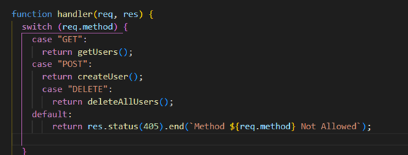
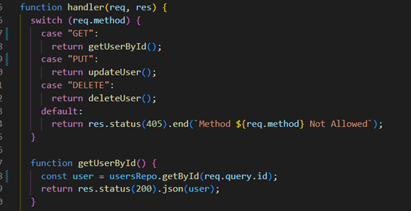
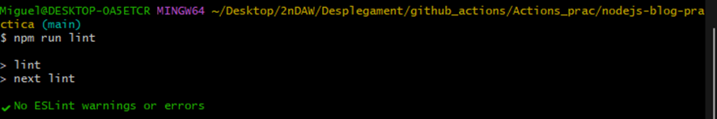

# Pràctica - GitHub Actions
Miguel Gandia Jorda

1. Clonamos el github.
2. Instalamos node
3. Para hacer funcionar el linter_job correctamente se ha de corregir los errores que puede ocasionar una mala sintaxis en el js, en este caso nos da estos errores:
 (aqui hay una imagen) 

Por lo que principalmente el error consistiria en solucionarlo de la siguiente manera,
Aparentemente nos muestra estos errores, simplemente los cambiamos en el archivo indicado.
 
 

Después de solucionar estos errores ya hemos llegado al final del apartado del linter_job:
 
4. Crear repositorio remoto, y hacer lo pertinente para que apunte este repositorio a nuestro nuevo repositorio

RESULTAT DELS ÚLTIMS TESTS

Resultats dels tests:
