# Pràctica - GitHub Actions
Miguel Gandia Jorda
Mi URL de Vercel: [Vercel Deployment](https://vercelactions-9pm4joyk2-miguels-projects-51c469f1.vercel.app/)


### 1. Clonamos el github.
### 2. Instalamos node
### 3. Para hacer funcionar el linter_job correctamente se ha de corregir los errores que puede ocasionar una mala sintaxis en el js, en este caso nos da estos errores:
 (aqui hay una imagen) 

Por lo que principalmente el error consistiria en solucionarlo de la siguiente manera,
Aparentemente nos muestra estos errores, simplemente los cambiamos en el archivo indicado.
ERROR EN LAS COMILLAS
 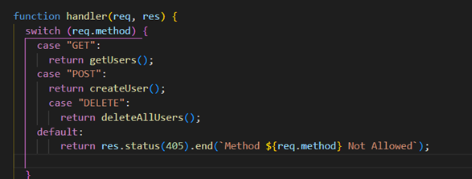
 ERROR EN LAS COMILLAS
 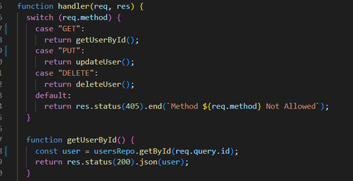

Después de solucionar estos errores ya hemos llegado al final del apartado del linter_job:
ERROR EN LAS VARIABLES
 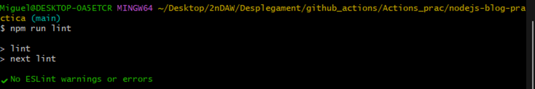
### 4. Crear repositorio remoto, y hacer lo pertinente para que apunte este repositorio a nuestro nuevo repositorio

### 5. Configuración del workflow del proyecto
Creamos la configuración del workflow del proyecto:

- Creamos una carpeta donde almacenamos los diferentes servicios de esta práctica.
- Dentro de la carpeta, creamos un archivo YAML llamado `node_js_workflow.yml`, donde ponemos todos los servicios. En primer lugar, configuramos para que se ejecute este archivo cada vez que haya un `push` de este modo:

### JOB_LINTER
**linter_job**: Este job se encarga de verificar la calidad del código mediante un linter. Al hacer un `push` al repositorio, se instalan las dependencias del proyecto y luego se ejecuta el comando `npm run lint`. Este proceso analiza el código JavaScript para identificar errores de sintaxis y de estilo, y asegura que el código cumpla con los estándares definidos. Si se encuentran errores, se muestran en los logs de la acción.
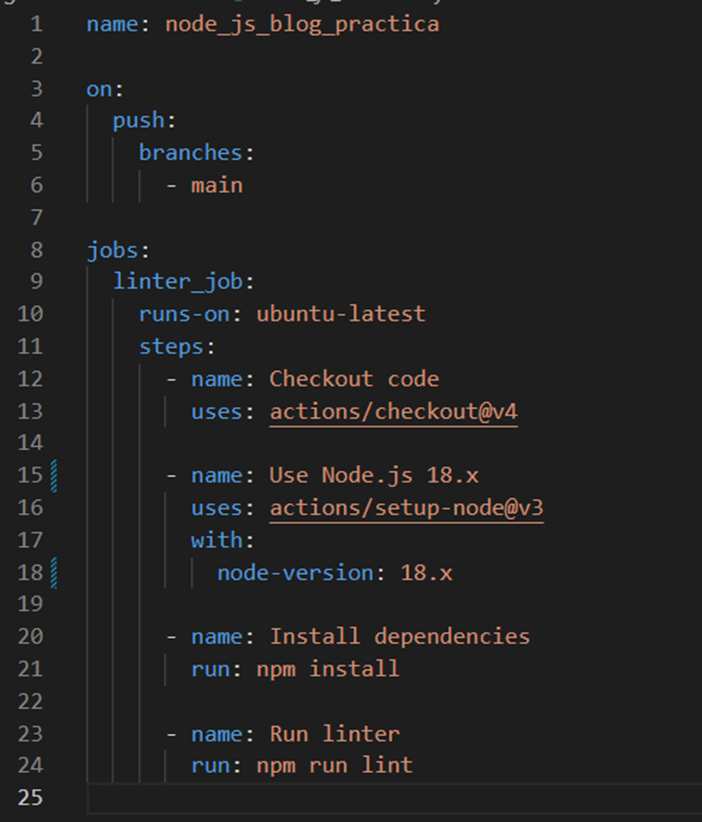

### 6.  Apartado Cypress_job
**cypress_job**: El `Cypress_job` ejecuta pruebas automatizadas de extremo a extremo utilizando Cypress. Este job primero instala las dependencias necesarias y luego inicia el servidor de la aplicación. A continuación, ejecuta las pruebas en un entorno controlado. Durante la ejecución, se espera a que el servidor esté disponible en el puerto 3000. Al finalizar las pruebas, se guardan los resultados en un archivo `result.txt` y se sube como artefacto para su posterior consulta.


Añadimos esto al archivo, para hacer el checkout, la instalación y la ejecución:

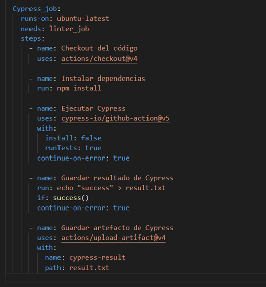
(Aquí faltaba añadir que se expone en el puerto 3000):
```yaml
- name: Ejecutar Cypress 
    uses: cypress-io/github-action@v6
    with:
        start: npm run start
        wait-on: "http://localhost:3000"
        wait-on-timeout: 60
    continue-on-error: true
```
En este caso preparamos el archivo para que guarde los resultados en un archivo result.txt.

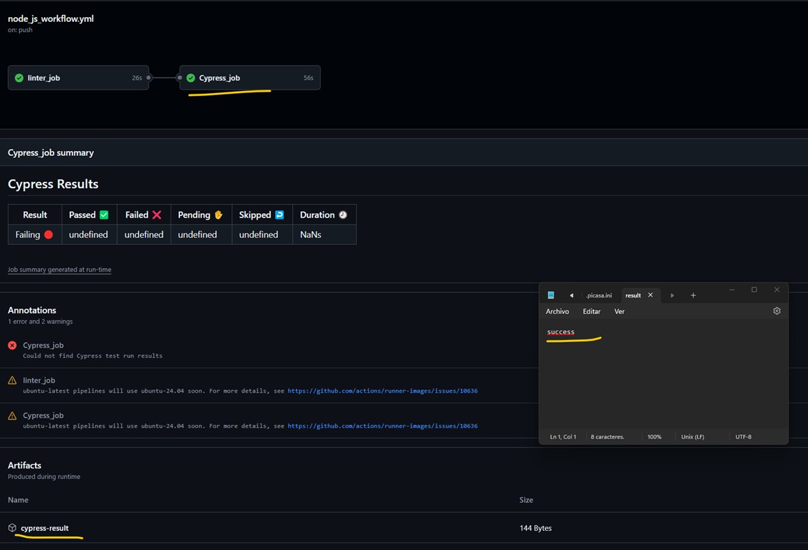

Como podemos observar, funciona correctamente.


### 7. Apartado Add_badge_job
**Add_badge_job**: Este job se encarga de modificar el archivo `README.md` y agregar un badge que refleja el estado de las pruebas. Después de que el `Cypress_job` haya terminado, este job descarga el resultado de las pruebas y, usando ese resultado, agrega un badge de éxito o fallo al `README.md` del proyecto. El `README.md` actualizado se sube luego al repositorio para reflejar el estado actual de las pruebas.


En este caso, hemos creado los diferentes steps que se piden en la práctica. Los primeros steps no tienen mucha dificultad, pero para los últimos hemos creado una carpeta donde guardamos un archivo YAML, en este caso action.yml, el cual utilizamos para modificar el README y escribir el resultado del test mediante JS. Y en el último step, realizamos el commit.

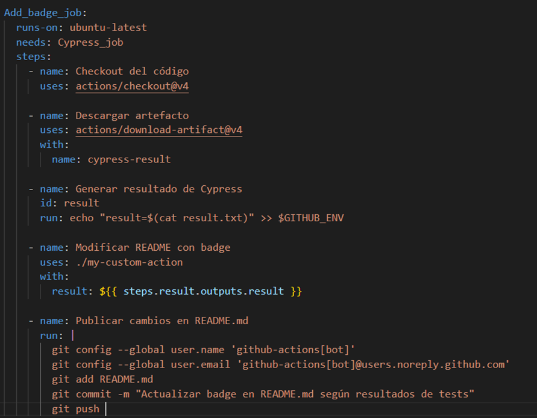


### 8. Apartado Deploy_job
**Deploy_job**: El `Deploy_job` maneja el despliegue de la aplicación en producción utilizando Vercel. Este job se ejecuta solo después de que las pruebas de Cypress se hayan completado exitosamente. En él, se utiliza el token de acceso a Vercel y se pasan los parámetros necesarios para desplegar el proyecto. El despliegue se realiza con el comando de Vercel y, al finalizar, la aplicación queda disponible públicamente.


Mi URL de Vercel: [Vercel Deployment](https://vercelactions-9pm4joyk2-miguels-projects-51c469f1.vercel.app/)

 - En primer lugar, instalamos Vercel con el siguiente comando:
npm install -g vercel
Nos logeamos desde la terminal bash.

Es importante guardar estos secretos en nuestro repositorio desde el entorno de GitHub.

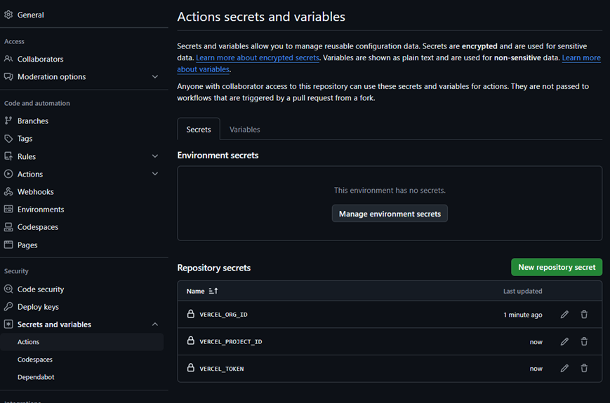


 - Los tokens se generaron al vincular Vercel con el repositorio local, lo que genera un archivo JSON con los secretos de la organización y del proyecto. El otro token debe generarse desde la web de Vercel y vincularse a nuestra organización en Vercel. Finalmente, realizamos el push.

 - Finalmente, nos funciona y podemos desplegar la web de manera correcta desde Vercel.

Y como puedes observar, he cambiado la página.

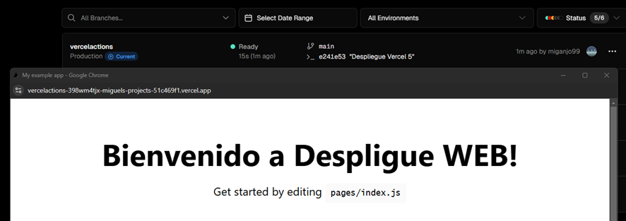


### 9. Apartado Notification_job
**Notification_job**:El `Notification_job` envía una notificación por correo electrónico con el resultado de todos los jobs previos: `linter_job`, `Cypress_job`, `Add_badge_job` y `Deploy_job`. Este job utiliza un servidor SMTP (configurado con un usuario y contraseña de Gmail) para enviar el correo. En el cuerpo del mensaje, se detallan los resultados de los trabajos, indicando si se completaron correctamente o fallaron, lo que permite mantener informado al equipo sobre el estado del proyecto.

Este apartado es del estilo del anterior job, ya que utilizamos secretos de GitHub. En este caso, utilizamos el servicio de envíos de correos SMTP. Para ello, debemos hacer algunas configuraciones en nuestro correo.

Estos serían mis secretos para la notificación:

 - (job.status) -> string -> Estado actual del trabajo. Los valores posibles son success, failure o cancelled.
 - La finalidad es enviar un correo con el resultado de los trabajos anteriores, y este es el correo que he recibido.
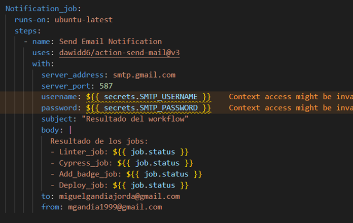
Luego me di cuenta de algo bastante obvio: este job de notificación necesita que los trabajos anteriores hayan terminado. Es decir, debe depender de esos trabajos, por lo que se debe poner esto:

needs: [linter_job, cypress_job, deploy_job]

### 10. Apartado Métricas
**github-metricas**:El `github-metricas` job genera un gráfico con métricas de calidad del código utilizando la herramienta `lowlighter/metrics`. Este job realiza un análisis del código en GitHub, generando datos como la actividad reciente, los lenguajes más utilizados y otras estadísticas del proyecto. Los resultados se almacenan en un archivo SVG que se inserta en el archivo `README.md`. Posteriormente, se sube al repositorio para que cualquier usuario que vea el repositorio pueda consultar las métricas de manera visual.

Configuramos la ejecución del job, generamos las métricas, especificamos algunos aspectos del plugin y hacemos push del README.

Esta sería la idea principal mediante la métrica de lowlighter, y empleamos un token de acceso personal a nuestro GitHub.

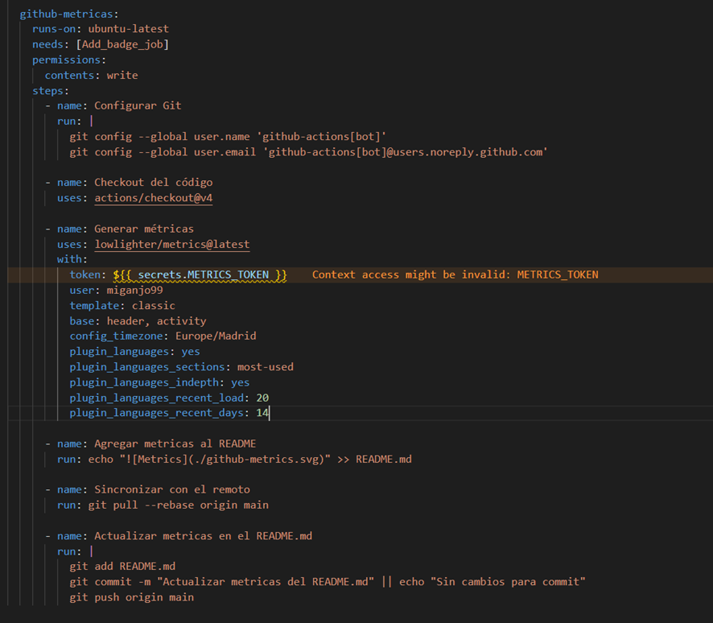
 - Generamos un token de acceso personal de GitHub.
 - Añadimos este token como secreto del repositorio con el nombre de METRICS_TOKEN.
 - Finalmente, el workflow final de la práctica quedaría de esta manera:

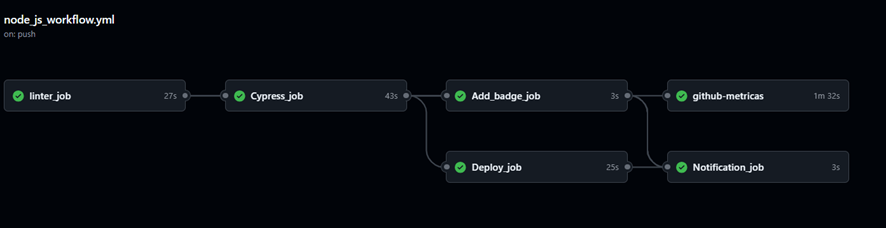


RESULTAT DELS ÚLTIMS TESTS


Resultats dels tests:

